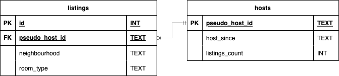
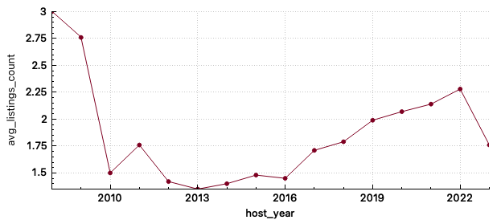
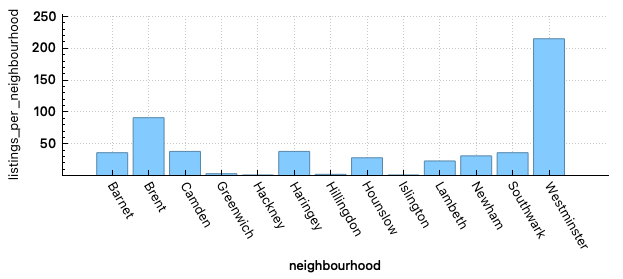

# [MScBA Business Analytics & Management student @ RSM :link:](https://www.rsm.nl/education/master/msc-programmes/mscba-business-analytics-management/)

## Projects

### Data Management with SQL using 'InsideAirbnb'

Data: [InsideAirbnb](http://insideairbnb.com/) London dataset

Find the full report [here](projects/sql/sql_report.pdf).

Find the full code [here](projects/sql/sql_code.txt).

#### Intro

While "shared economy" business models arose and were positioned as the cheaper alternatives to hotels that benefit individuals, with years it has developed into a professional marketplace. In this project I investigated the severity of Airbnb presence in London on its' citizens.

#### Tech Stack

- SQLite
- DB Browser for SQLite

#### Features

Given the current housing crisis in London, I was interested in seeing how the hosts developed their listings portfolio and how those could affect the scarcity in the property market in London.

In the report, I posed these questions regarding the London Airbnb market:

- What is the average number of listings per host based on the year of joining the Airbnb platform?
- What is the number of listings for all neighbourhoods for the biggest host?

#### Process

To achieve that, a two-step The first part involved wrangling the original data from InsideAirbnb (using SQL). Some of the processes involved:

- Checking for duplicated data
- Handling of the missing values: resolved by imputation (due to low number of missing values)
- Outliers analysis
- Date formatting
- Spelling errors
- Pseudomization of sensitive data (GDPR compliance)

The second part of the project involved implementing the database in line with normalization principles, as shown below, as well as the querying required to answer the research questions. While the original dataset contains many more variables, only the ones relevant for answering the reserarch questions were added to the database.

#### Results

For the first question, the following visualization was made:

Two interesting patterns arise:

1. For the hosts who joined between 2010 and 2016, the number of listings is relatively low. At that time, Airbnb was booming in popularity, but people still used it as intended.
2. For the hosts who joined after 2016, the later the hosts were joining the platform, the more listings they had on average. Based on that finding, I argue that the intention of new hosts on the platform was to generate additional income by investing and renting the properties in a short-term.

For the second question, I found the following:

Westminster, as a central location in London, is clearly favoured over other neighbourhoods. Easy access to tourist attractions, as well as great connection to many other parts of London makes this district a prime location for short-term property rental. Interestingly, Brent was the second biggest neighbour in terms of nubmer of listings offered by the biggest host. Perhaps the good transport connection to other parts of London, as well as the Wembley Stadium could explain why this area is of an interest to professional Airbnb hosts.

### Process mining for an insurance company using Celonis

#### Intro

For the Business Analytics Workshop course during my master, I was a part of the team responsible for bringing insights for the dutch insurance firm using process mining. The company wanted to understand better how fast are their processes related to clients executed.

#### Tech Stack

- Celonis
- Python
- PM4PY

#### Features

The goal was to provide the company with deeper insight into their current processes. While the company does have a "perfect case" scenario planned for handling the applications of all customers, it is harder to control and execute that plan in the same way for very different customers. Additionally, the manual effort on the staff of the company further fuels this discrepancy. To this end, the analysis involved looking at how the applications are handled from start until resolution, how long do certain parts of the process take, as well as whether there are any patterns between the processes and the types of clients.

#### Learnings

Up until this project, I had no experience working on process mining. However, thanks to this opportunity I was able to deepen my understandign of this part of analytics. Some of the key aspects of the process mining processes involve:

- Process discovery: transforming the event log into process model
- Conformance checking: comparing the _de facto_ models against the firm expectations
- Performance analysis: analysing the duration of the processes, rework, definition of happy / unhappy flows

Additionally, during the project I learned how to use **Celonis**. More specifically, I was responsible for:

- Configuring the data model consisting of multiple tables
- Developing dashboards
- Redefining KPI's, e.g.: rework

Thanks to the use of additional data sets, I was able to expand the scope of analysis with client-specific information, allowing more depth in understanding the processes.

_Side note_: Initially the goal was to perform the analysis using Python's **PM4PY** library. However, based on the feedback from the company, as well as the time effort required, it became clear that Celonis provides better quality of analysis suitable to their needs. Use of dashboards and dynamic filtering, similar to PowerBi / Tableau, is more intuitive to end user of the analysis than the implementation of process mining in Python.

### Predicting number of enrolled students at the university

#### Intro

Every year, the planning team at RSM faces a challenge of allocating the classrooms to all courses within the portfolio of master programmes. While those programmes start only in September, the initial allocation of the rooms occurs already in March. At the same time, the applications itself start almost a year before the academic year, in October.

#### Tech Stack

- R
- Tidymodels package

#### Features

Current processes for predicting the number of enrolled students at the beginning of the academic year involve the use of heuristics. To improve on that, the goal was to use machine learning algorithms to achieve higher quality of a prediction and possibly save time for the planning team.

#### Process

The data supplied for this assignment has been pre-cleaned. Because of that I was able to move directly to **feature engineering**. Given I was supplied the full dates of application, offer (from university) and response for each student, I created new categorical variables for months from each of these dates. The goal was to allow the algorithm to find any time-pattern of the application (e.g., applications made in October, at the beginning of the application process, might have a higher chance of enrolment). Another seemingly useful variable contained the number of days that passed from application to offer from university. One could anticipate that longer waiting time decreases a chance student will enrol. The rest of data provided demographic information of each student, as well as their academic background and was kept as originally supplied.

Next part involved creating correct **training-test** splits. Given the temporal nature of the underlying data (application windows of academic years (AY) 2020 - 2023), great amount of time went into deciding which years to use for analysis and assesment sets. The following split was established:

Analysis set:

- AY 2020
- AY 2021

Assessment set

- AY 2022 (censored)

Final training set:

- AY 2020
- AY 2021
- AY 2022

Prediction set:

- AY 2023 (censored)

Analysis set was used to train multiple models, which were then ranked based on their performance on assessment set. Once the best model was selected, it was retrained using final training set to predict the enrollments for AY 2023.

To improve the predictive power of the model, ten-fold cross-validation was used. While this number of folds can be computationally expensive on larger datasets and more complex algorithms, the underlying data for this assignment was relatively small (n = 10,840). Additionally, within each fold a strata was applied on the status (enrolled, declined, no response) variable.

Next, multiple **models** were tuned and tested. Analysis set was used to train and tune tree-based (Random Forest, Gradient Boosting), regularized (Lasso, Ridge, elastic net) and non-parametric (kNN) models. Depending on the type of the model, specific pre-processing steps were taken (standardizing numerical variables, imputation of missing values, oversampling with SMOTE-NC). The elastic net ended up performing the best and was used for the prediction.

The main metric of success in this case has been an **F1 score**. This metric balances sensitivity with precision. Since the business cost of allocating a classroom that is too small for the specific cohort is very high in comparison with allocating too big of a space, precision is an important part. At the same time, however, **sensitivity** as a second metric helps limit the instances of underutilizing the classrooms.

After retraining on a final training set, the model achieved an F1 score of **0.985**. Given the high performance of the model, the error analysis that followed did not yield any significant findings.
